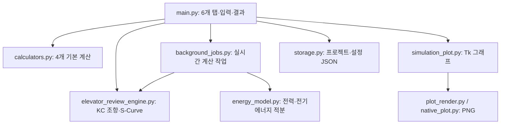
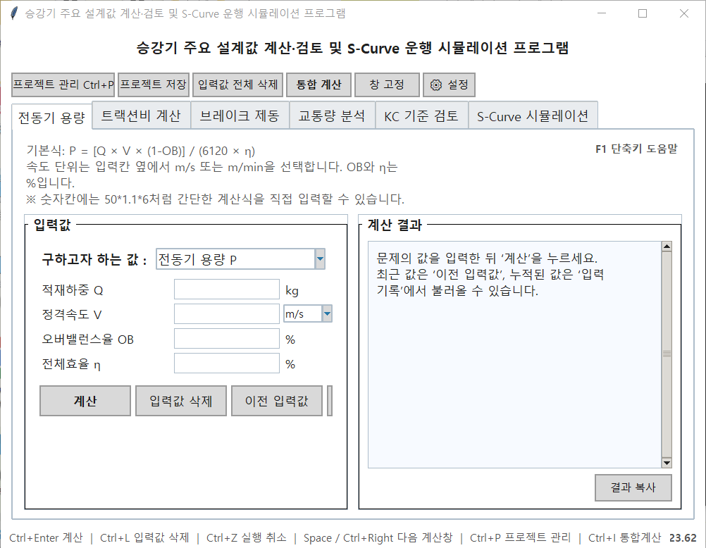
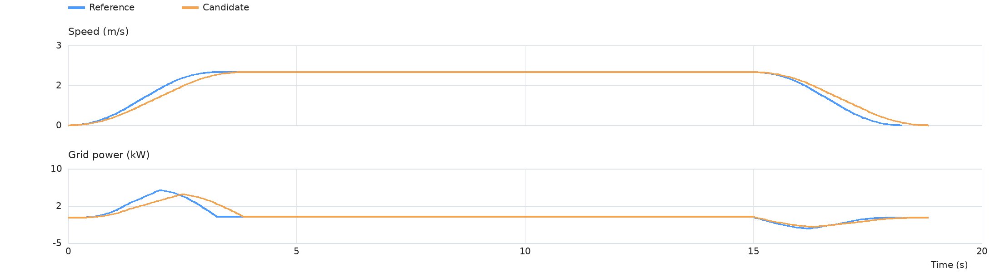

# 승강기 설계값 계산·검토 및 S-Curve 시뮬레이션

전동기 용량, 트랙션비, 브레이크 제동, 교통량의 계산과 KC 조항별 입력 검토, S-Curve 기계동력·전기에너지 **모델 추정**을 한 화면에서 실행하는 Tkinter 앱입니다. 법정 적합성의 최종 판정이나 실측 없는 절감 성능 검증 도구로 사용하지 마세요.

## 실행

Python 3.10 이상과 Tkinter가 필요합니다. 이 버전은 Python 3.12에서 자동 검사를 실행했습니다. **Python 3.14 / Windows 실행 파일은 이 작업 환경에서 실행 검증하지 않았습니다.** Pillow는 그래프의 부드러운 글꼴과 렌더링을 위한 선택 항목이며, 설치되지 않아도 표준 라이브러리 PNG 렌더러를 사용합니다.

```bash
python main.py
python main.py --self-test
python -m pip install -r requirements-dev.txt
python -m pytest -q tests
```

Windows 실행 파일을 직접 빌드할 경우, 동일한 폴더에서 `pyinstaller --onefile --windowed main.py`를 실행합니다. 이미지와 계산 모듈이 함께 포함되는지 빌드 결과를 확인하세요.

## 구조



`errors.py`는 입력 오류와 시뮬레이션 샘플 초과 오류를 정의합니다. `energy_model.py`의 `EnergyTripInput`은 운행 파라미터를 불변 데이터로 정규화하고 값의 범위를 검증합니다. 시뮬레이션의 실시간 재계산만 작업 스레드에서 수행하고 Tk 화면 수정은 메인 스레드에서 수행합니다. 입력 변경 시 대기 중인 작업을 취소하고, 이미 실행 중인 오래된 결과는 화면에 적용하지 않습니다. 창 크기 변화에 따른 그래프 재그리기는 80ms 단위로 지연하고, 운행당 시간 샘플은 최대 약 20,000개, 선분 렌더링은 시리즈당 최대 1,500개로 제한합니다. 사용자가 버튼으로 실행하는 계산과 PNG 저장은 아직 메인 스레드에서 처리합니다.

## 주요 수식과 단위

| 기능 | 모델 | 범위·주의 |
| --- | --- | --- |
| 전동기 용량 | `P = Q × V × (1 − OB) / (6120 × η)` | Q kg, V m/min, OB·η 비율. 기본 설계 계산용입니다. |
| 트랙션비 | 전부하/무부하 양쪽 장력비를 계산하고 큰 값 표시 | 로프·균형추 등 입력 조건에 따라 달라집니다. |
| 브레이크 | `d = v × t / 2`, `a = v / t` | 등감속 가정. 추가로 입력된 값이 계산값과 일치하는지 검사합니다. |
| 교통량 | `수송능력 = 300 × 탑승자 수 / RTT` | 특정 교재의 초기 설계 추정치이며 건물별 입력과 운전방식 가정에 의존합니다. |
| 전기에너지 | `E = ∫P_grid(t) dt / 3600` (kWh) | 구동 효율·회생 효율·저항·보조전력을 입력값의 상수로 가정합니다. |

카의 정격 적재용량을 별도로 입력받아 실제 적재 질량과 대조하는 기능은 없습니다. 따라서 `load_mass`가 정격하중을 초과하는지는 현재 자동 확인할 수 없습니다. 제조사 실측 속도·전력 CSV의 오차가 없어도 화면에 표시되는 절감률은 **입력 모델의 계산값**입니다.

## 화면



위 UI 화면은 **이전 빌드의 사용자 제공 캡처**입니다. 아래 그래프는 이 버전의 렌더러가 생성한 결과입니다.



## 테스트·버전 관리

`tests/`의 pytest 테스트는 각 계산식을 독립 산술값과 비교하고 경계값·손상 설정 파일·작업 함수를 점검합니다. 종전의 `test_*.py` 자체 점검은 `python test_calculators.py`처럼 각각 실행할 수 있습니다. `git log --oneline`으로 수정 이력을 확인하세요. 실제 Windows 창 동작과 Python 3.14 빌드 결과는 별도 실기기 시험이 필요합니다.
