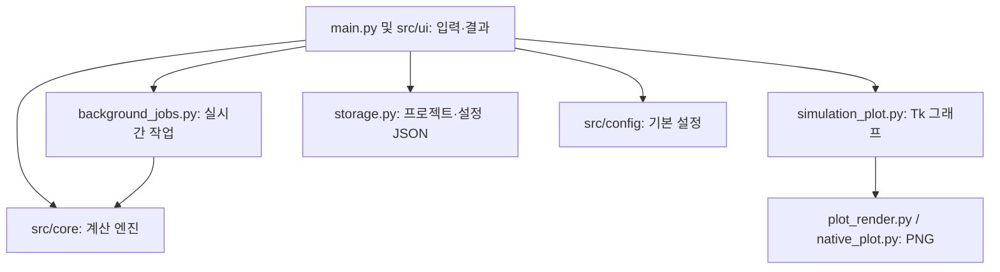

# 승강기 설계값 계산·검토 및 S-Curve 시뮬레이션

전동기 용량, 트랙션비, 브레이크 제동, 교통량의 계산과 KC 조항별 입력 검토, S-Curve 기계동력·전기에너지 **모델 추정**을 한 화면에서 실행하는 Tkinter 앱입니다. 관성·가속 토크와 운전 주기별 모터/저항기 발열 추정도 포함합니다. 법정 적합성의 최종 판정이나 실측 없는 절감 성능 검증 도구로 사용하지 마세요.

`KC 기준 검토 > 현장 관찰 기록`에서 NCS 엘리베이터 점검 모듈의 위치별 학습 흐름을 참고한 기록을 남길 수 있습니다. 기계실·카·승강로·승강장·피트의 관찰 내용과 자료 출처를 프로젝트에 함께 저장합니다. 이 기록은 KC 적합 판정과 분리됩니다. 자료의 판본과 활용 범위는 [NCS 참고 문서](docs/NCS_REFERENCE.md)를 보세요.

## 실행

Python 3.10 이상과 Tkinter가 필요합니다. 이 버전은 Python 3.12에서 자동 검사를 실행했습니다. **Python 3.14 / Windows 실행 파일은 이 작업 환경에서 실행 검증하지 않았습니다.** Pillow는 그래프의 부드러운 글꼴과 렌더링을 위한 선택 항목이며, 설치되지 않아도 표준 라이브러리 PNG 렌더러를 사용합니다.

```bash
python main.py
python main.py --self-test
python -m pip install -r requirements-dev.txt
python -m pytest -q tests
python -m pytest -q tests --cov=src.core --cov-branch --cov-report=term-missing
sh scripts/verify.sh
```

Windows 실행 파일을 직접 빌드할 경우, 동일한 폴더에서 `pyinstaller --onefile --windowed main.py`를 실행합니다. 이미지와 계산 모듈이 함께 포함되는지 빌드 결과를 확인하세요.

**공학 데이터 도구:** S-Curve 시뮬레이션의 기계동력 곡선 화면에서 열 수 있습니다. 물리식 기반 설계 후보 탐색, CSV/WAV 신호 지표 분석, PDF/이미지의 입력 후보 추출을 제공합니다. PDF 문자 추출을 사용하려면 `pip install -r requirements.txt`로 `pypdf`를 설치하세요. 이미지/스캔 PDF OCR에는 Tesseract가 필요하고, 스캔 PDF에는 `pymupdf`도 필요합니다. 진단 확률·잔여 수명, 도면 자동 인증 또는 제조사 최적 설계는 제공하지 않습니다. 가정과 검증 한계는 [공학 데이터 도구 안내](docs/ENGINEERING_DATA_TOOLS.md)에 있습니다.

Linux Python 3.12에서 PyInstaller 단일 파일을 생성하고 `--self-test` 실행을 점검했습니다. 현재 빌드 머신의 비표준 Tk 9 설치는 Tcl 공유 라이브러리를 명시적으로 포함해야 하므로, 그 바이너리를 범용 Linux 배포판이라고 주장하지 않습니다. 이 검사는 Windows GUI 버튼·탭·PNG 저장의 실제 작동 확인을 대신하지 않습니다.

## 구조



`src/core/calculators.py`, `src/core/energy_model.py`, `src/core/elevator_review_engine.py`, `src/core/motor_dynamics.py`는 GUI 패키지를 참조하지 않습니다. 저크 제한 운행 궤적은 `src/core/trajectory.py`로 분리하여 에너지·모터 모델이 KC 기준 검토 모듈을 참조하지 않습니다. 기존 `elevator_review_engine.scurve_profile` import도 동작합니다. 루트의 기존 계산 파일들은 이전 import를 위한 호환 경로입니다. 순수 계산 엔진은 새 UI에서 그대로 호출할 수 있습니다. `src/core/errors.py`는 입력 오류와 샘플 초과 오류를 정의합니다. `EnergyTripInput`과 `MotorDutyInput`은 직접 생성해도 파라미터를 검증하는 불변 데이터입니다. 시뮬레이션의 실시간 재계산은 작업 스레드에서 수행하고 Tk 화면 수정은 메인 스레드에서 수행합니다. 입력 변경 시 대기 중인 작업을 취소하고 오래된 결과는 화면에 적용하지 않습니다. 그래프 재그리기는 80ms 단위로 지연하고 운행당 최대 약 20,000 시간 샘플, 선분은 시리즈당 최대 1,500개입니다. 버튼으로 실행하는 계산 및 PNG 저장은 메인 스레드에서 처리합니다.

키보드 이동은 `src/ui/keyboard_navigation.py`, 여섯 탭의 저장값 정리는 `src/ui/project_snapshot.py`에 있습니다. 여섯 화면 클래스는 각각 `src/ui/motor_panel.py`, `src/ui/traction_panel.py`, `src/ui/brake_panel.py`, `src/ui/traffic_panel.py`, `src/ui/criteria_panel.py`, `src/ui/scurve_panel.py`로 분리하여 공통 화면 도우미를 서비스로 전달합니다. `main.py`에는 앱 조립, 탭 생성, 화면 공통 도우미, 실시간 계산 제어가 남아 있습니다. 관성·열부하 상세 입력창은 `src/ui/motor_duty_dialog.py`, 그래프 창과 기록 관리는 `src/ui/graph_workspace.py`에 있습니다. 테마 색상표는 Tk를 로드하지 않는 `src/config/themes.py`에 두므로 `storage.py`는 화면 모듈 없이 불러올 수 있습니다. 기존 `--self-test` 실행 코드는 `src/diagnostics/self_test.py`에 있습니다.

전동기 상세창은 입력 중 350ms 지연 계산, Enter 수동 계산·입력 기록, 입력칸 위 휠 스크롤, 이전 입력·결과 복사를 지원합니다. 입력 기록창은 프로젝트 관리창처럼 행 클릭/드래그 체크, 선택 삭제, 기록명 변경을 지원합니다. 로프 장력·층별 5분 수송 그래프는 별도 창에서 고정·PNG 저장을 지원합니다. 그래프명과 담당자, 입력 상태를 저장하고 종류별 그래프 관리에서 여러 개를 선택해 독립된 창으로 불러오거나 삭제할 수 있습니다. **함께 불러온 같은 종류의 그래프는 둥근 눈금값의 공통 축으로 표시하며, PNG 저장에도 같은 축이 적용됩니다.** 입력 조건을 다시 계산하므로 PNG 이미지를 기록에 내장하지 않습니다. 수송 그래프는 먼저 교통량 계산이 끝나야 열리며 그래프 저장은 수송 그래프창에서 실행합니다. 시뮬레이션 탭의 그래프는 화면에서 자동 갱신하고, 저장된 기계동력·전기에너지 그래프는 각 탭의 ‘시뮬레이션 관리’에서 별도로 불러옵니다.

숫자 입력칸에서 Enter를 누르면 현재 계산을 실행합니다. **계산 후 Tab을 누르면 다음 계산 탭으로 이동하여 첫 입력값을 전체 선택**합니다. 계산 전에 Tab을 누르면 현재 탭의 다음 입력칸 값을 전체 선택합니다. 시뮬레이션에서 계산 전 마지막 입력칸의 Tab은 기계동력 곡선에서 전기에너지 비교로, 전기에너지 비교에서 다음 계산 탭으로 이동합니다. 결과 표시창에 초점을 둔 상태에서 Tab을 눌러도 다음 계산 탭으로 이동합니다. Shift+Tab은 계산 전 입력 순서를 거꾸로 이동합니다.

기준 검토의 `KC 2050-51:2022`는 [행정안전부 고시 별표 22 「엘리베이터 안전기준」](https://law.go.kr/LSW/flDownload.do?flSeq=141709087) 첫 페이지에 적힌 문서 식별 표기입니다. `KC 2050-51`은 그 문서의 번호, `2022`는 문서에 표시된 연도입니다. 프로그램은 개별 입력 조건만 검토하며, 해당 표기가 프로그램의 인증이나 현행 기준 전체의 충족을 뜻하지는 않습니다.

## 주요 수식과 단위

| 기능 | 모델 | 범위·주의 |
| --- | --- | --- |
| 전동기 용량 | `P = Q × V × (1 − OB) / (6120 × η)` | Q kg, V m/min, OB·η 비율. 기본 설계 계산용입니다. |
| 트랙션비 | 전부하/무부하 양쪽 장력비를 계산하고 큰 값 표시 | 로프·균형추 등 입력 조건에 따라 달라집니다. |
| 브레이크 | `d = v × t / 2`, `a = v / t` | 등감속 가정. 추가로 입력된 값이 계산값과 일치하는지 검사합니다. |
| 교통량 | `수송능력 = 300 × 탑승자 수 / RTT` | 특정 교재의 초기 설계 추정치이며 건물별 입력과 운전방식 가정에 의존합니다. |
| 전기에너지 | `E = ∫P_grid(t) dt / 3600` (kWh) | 구동 효율·회생 효율·저항·보조전력을 입력값의 상수로 가정합니다. |
| 축 관성 | `k = 기어비 × 로핑비 / 도르래 반지름`, `J합 = J모터 + M이동/k²` | k rad/m, J kg·m². 모터축 환산 및 속도 불변 기어비 가정. |
| 가속 토크 | `T = (F불평형+M이동×a)/k + J모터×k×a` | 모터축 N·m. S-Curve 각 샘플의 부호·최고 절댓값을 사용. |
| 운전율·열 | `%ED = 주행시간/반복주기×100`, `T_RMS = √[∫T²dt/반복주기]` | 정지 중 토크 0 가정. 제조사 허용 토크·온도와 별도로 대조해야 합니다. |
| 저항기 | `P저항=max(0,−Tω)×(1−회생비율)`, `E=∫P저항dt` | 피크 kW, 회당 kJ, 주기 평균 kW. 회생·저항 경로의 단순화된 분담 모델. |

전동기 용량 탭의 `관성·가속 토크 / 열부하` 버튼으로 정밀 입력 창을 엽니다. 정격 적재와 실제 적재를 비교하며, 선택한 입력은 프로젝트 상태에 함께 저장됩니다. 이 창의 저항기 결과는 **전기적 제동 저항**만 다루며, 안전 브레이크의 정지·마찰 발열 검증이 아닙니다. 모터의 허용 피크/연속 토크 및 저항기 피크/펄스/평균 정격 입력이나 판정은 포함하지 않습니다. 전기에너지 비교 탭은 별개 모델이므로 그 탭의 정격 적재 초과는 자동 확인하지 않습니다. 제조사 실측 속도·전력 CSV의 오차가 없어도 화면의 절감률은 **입력 모델의 계산값**입니다.

트랙션 탭의 `로프 장력 분포 그래프`는 카의 위치에 따른 양쪽 로프의 **가닥별 정적 장력**을 비교합니다. 카/균형추 질량과 매달린 로프의 길이만 반영하며 가속 하중·보상체인·도르래 마찰은 제외합니다. 교통량 분석을 계산한 후 `층별 5분 수송 그래프`를 누르면 현재 정원·층수·운행시간을 사용하여 300초 내 완료된 운행의 목적층별 인원을 보여줍니다. 목적층은 균등 확률과 고정 시드로 추출하며, 실제 승객 도착·배차·대기행렬은 반영하지 않습니다. 비교를 위한 초기 시뮬레이션입니다.

## 화면


위 UI 화면은 **이전 빌드의 사용자 제공 캡처**입니다. 아래 그래프는 이 버전의 렌더러가 생성한 결과입니다.


## 테스트·버전 관리

`tests/`의 pytest 테스트는 계산식을 독립 산술값·이상화 에너지 수지와 비교하고 경계값·손상 설정 파일·작업 함수를 점검합니다. `test_motor_dynamics.py`는 경계값과 관성·운전주기·회생 분담 사례를 포함하며 축 환산/운전율/회생 분담에 대해 독립 기준과 상대 오차 `1e-8` 이하로 비교합니다. **이 수치는 구현에 대한 산술 검증 허용 오차이며, 실측 정확도나 공단 검증을 뜻하지 않습니다.** 공식 KOEL·교재 원문의 입력/정답이 확인된 20~30개 예제는 현재 포함되지 않습니다. KC 문서의 개별 항목 대조는 [원문 대조표](docs/KC_SOURCE_MATRIX.md)에 기록했으며 EN 81-20/50 전체 적용을 주장하지 않습니다. Python 3.12에서 `189 passed`, **`src/core`만** 대상으로 줄·분기 합산 커버리지 **90.82%**를 측정했습니다. CI와 로컬 훅은 이 범위가 90% 미만으로 내려가면 실패합니다. UI·저장 코드 및 Windows의 실행 커버리지는 이 수치에 포함되지 않고, 다른 OS/버전의 수치를 보장하지 않습니다. 기존의 `test_*.py` 자체 점검은 각각 실행할 수 있습니다.

`.github/workflows/verify.yml`에는 push/PR 시 Python 3.12·3.14 계산 테스트와 Windows 3.14 실행 파일 빌드, 빌드된 EXE의 `--self-test`, 아티팩트 업로드를 정의했습니다. 이번 수정은 로컬 브랜치에 있으며 해당 Windows CI 실행 결과는 아직 없습니다. 실행 상태는 [Actions 탭](https://github.com/parkjongho1027-svg/EL-/actions)에서 확인하세요. 빌드와 자체 테스트가 성공하더라도 Windows 화면 조작이나 90% 커버리지 또는 제조사 승인 결과를 증명하지 않습니다. `git log --oneline`으로 이력을 확인하세요.

로컬 커밋 전 검사 설정: 개발 패키지를 설치한 뒤 `git config core.hooksPath .githooks`를 **클론마다 한 번** 실행합니다. Git이 자동 생성한 `.git/hooks/*.sample`은 그대로 두어도 됩니다. 추적되는 `.githooks/pre-commit`이 `scripts/verify.sh`를 실행하고, 같은 스크립트를 원격 CI가 실행합니다. staged 공백 검사와 `src/core`, `src/ui`, `tests`의 제한된 Ruff 규칙, 컴파일 및 pytest·계산 엔진 커버리지·기존 자체 점검이 실행됩니다. `main.py` 전체에 대한 포맷터 적용은 아직 검증하지 않았습니다. 소스 경로·공개 버전·로컬 이력의 대응 관계는 [릴리스 이력](docs/RELEASE_HISTORY.md)을 확인하세요.

남은 화면 공통 도우미 정리, 공인 예제 확보, 실측 검증과 배포의 주차별 완료 조건은 [검증 계획](docs/VALIDATION_PLAN.md)에 정리했습니다. 실측 자료의 형식과 Windows 확인 항목은 [측정·검증 절차](docs/MEASUREMENT_PROTOCOL.md)와 [그래프 GUI 확인 절차](docs/GRAPH_GUI_CHECKS.md)를 참고하세요.
